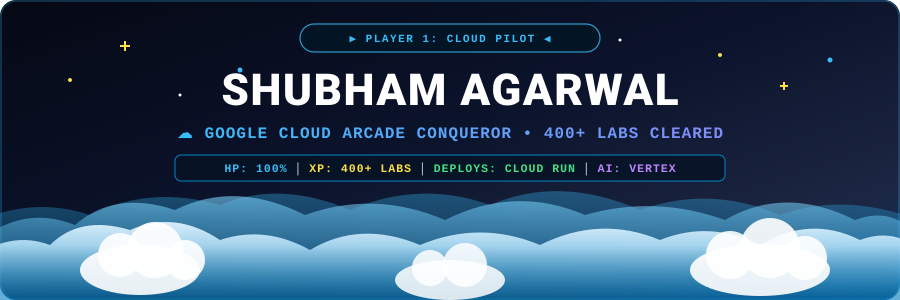

<div align="center">

<!-- CLOUD CUTOUT RETRO ARCADE BANNER -->


<br/>

<!-- ACTION BADGES -->
<p align="center">
  <a href="https://www.linkedin.com/in/shubham-agrawal-856601244" target="_blank">
    
  </a>
  <a href="mailto:shubham.23bcon0370@jecrcu.edu.in">
    
  </a>
  <a href="https://cloudskillsboost.google" target="_blank">
    
  </a>
  <a href="https://github.com/Shagarwal07">
    
  </a>
</p>

</div>

---

### 👾 Character Sheet & Cloud Stats

```yaml
Character   : Shubham Agarwal [Player 1]
Class       : Cloud Pilot / Systems Builder ☁️
Home Realm  : Google Cloud Platform (Arcade Track)
Motto       : "Build fast, package in Docker, ship to Cloud Run."

[ STATS & ATTRIBUTES ]
☁️ Cloud Stamina       : [████████████████████] LVL 99 (400+ GCP Labs Conquered)
⚡ Prototyping Speed   : [████████████████░░░░] High Velocity Builds
📦 Containerization    : [██████████████░░░░░░] Docker & Cloud Run Deploys
🧠 AI Integration      : [█████████████░░░░░░░] Gemini & Vertex AI Workflows
💾 Data Persistence    : [████████████░░░░░░░░] PostgreSQL & Spring Boot Connectors
```

---

### 🗺️ The Cloud Game Loop

```
       [ 👾 Real-World Problem Boss ]
                     │
                     ▼
       [ 💡 Rapid Prototyping & Iteration ]
                     │
                     ▼
   [ 🧩 Data & Backend Connectors (PostgreSQL / APIs) ]
                     │
                     ▼
       [ 📦 Sealed in Docker Container ]
                     │
                     ▼
       [ ☁️ Launched to Google Cloud Run 🚀 ]
```

---

### ⚔️ Completed Quests (Proof of Work)

<table>
  <tr>
    <td width="50%" valign="top">
      <h4>🗳️ <a href="https://github.com/Shagarwal07/Voter_scrap">Quest: The Civic Data Engine</a></h4>
      <p><i>Mission: Defeat sluggish public document searching and build an instant voter lookup portal.</i></p>
      <ul>
        <li><b>Objective:</b> Automated ingestion pipeline for public voter records.</li>
        <li><b>Execution:</b> Multi-filter search interface with instant response times.</li>
        <li><b>Loot / Infra:</b> <code>Google Cloud Run</code> • <code>Fast Search APIs</code> • <code>Docker</code></li>
      </ul>
    </td>
    <td width="50%" valign="top">
      <h4>🎓 <a href="https://github.com/Shagarwal07/LearnStudio">Quest: The LearnStudio Citadel</a></h4>
      <p><i>Mission: Construct a multi-tiered online learning hub for structured curriculum.</i></p>
      <ul>
        <li><b>Objective:</b> Course catalog, user roles, video tracking & authentication.</li>
        <li><b>Execution:</b> Relational database persistence with clean REST endpoints.</li>
        <li><b>Loot / Infra:</b> <code>Spring Boot</code> • <code>PostgreSQL</code> • <code>Docker</code></li>
      </ul>
    </td>
  </tr>
  <tr>
    <td width="50%" valign="top">
      <h4>🏛️ <a href="https://github.com/Shagarwal07/Maharaja_agrasen_balotra">Quest: Guild of Balotra</a></h4>
      <p><i>Mission: Digitize paper records into an institutional community portal.</i></p>
      <ul>
        <li><b>Objective:</b> Member registry, searchable directories, and role management.</li>
        <li><b>Execution:</b> Structured relational schema and administrative control.</li>
        <li><b>Loot / Infra:</b> <code>Relational DB</code> • <code>Web Portal</code> • <code>Admin Tools</code></li>
      </ul>
    </td>
    <td width="50%" valign="top">
      <h4>🔮 Quest: The Gemini Oracle</h4>
      <p><i>Mission: Supercharge web applications with multimodal intelligence.</i></p>
      <ul>
        <li><b>Objective:</b> Move beyond generic chatbots to contextual app intelligence.</li>
        <li><b>Execution:</b> Vertex AI pipelines, Gemini API & RAG document retrieval.</li>
        <li><b>Loot / Infra:</b> <code>Vertex AI</code> • <code>Gemini</code> • <code>RAG</code> • <code>OpenRouter</code></li>
      </ul>
    </td>
  </tr>
</table>

---

### 🏆 Arcade Trophies & Cloud Achievements

```
[ GOOGLE CLOUD ARCADE & SKILLS BOOST EXP ]
├── 🏅 Master Explorer : 400+ Hands-on Cloud Labs Cleared
├── 🚀 Cloud Run Hero  : Stateless container deployments in production
├── 🔨 Pipeline Runner : Artifact Registry & Cloud Build automation
└── 🧠 Neural Alchemist: Vertex AI model integration & API orchestration
```

---

### 🎒 Inventory & Equipped Tools

<div align="center">
  
</div>

<br/>

* **Cloud & Serverless:** Google Cloud Platform (Cloud Run, Cloud Build, Artifact Registry)
* **Containers & Orchestration:** Docker, Kubernetes
* **Databases & Backends:** PostgreSQL, Spring Boot, REST APIs, JSON Data Pipelines
* **Applied Intelligence:** Gemini 1.5/2.0 API, Vertex AI, RAG Architectures, OpenRouter
* **Dev Gear:** Linux, Git, GitHub Actions, Postman, Maven

---

### 📊 Arcade Leaderboard Stats

<div align="center">
  
  
</div>

<br/>

<div align="center">
  
</div>

---

<div align="center">
  <p>🕹️ <i>"Level up by deploying. Solve real problems, conquer the cloud, and keep shipping."</i></p>
  <sub>Ready to Co-op? Connect on <a href="https://www.linkedin.com/in/shubham-agrawal-856601244">LinkedIn</a> or send an <a href="mailto:shubham.23bcon0370@jecrcu.edu.in">Email</a></sub>
</div>